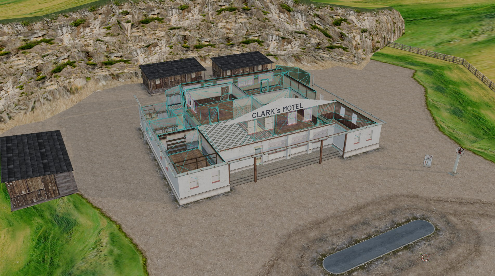
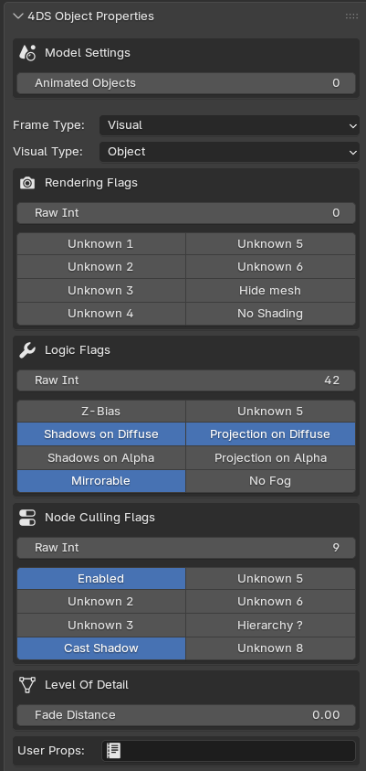
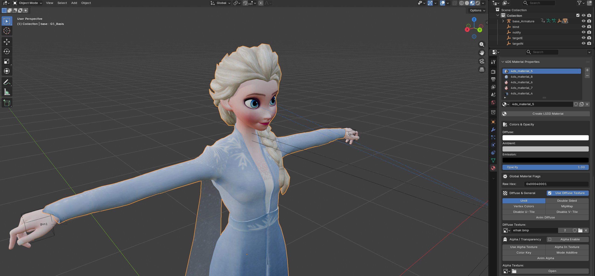

# Mafia4Blender · 4DS Importer/Exporter

**Bring *Mafia: The City of Lost Heaven* models into Blender — and your own creations back into the game.**

[Features](#-features) · [Quick Start](#-quick-start) · [Documentation](#-documentation) · [Limitations](#%EF%B8%8F-known-limitations) · [Credits](#-credits)

*Clark's Motel, imported straight from the game — the cyan wireframes are its interior [sectors](https://github.com/Richard01CZ/Mafia4Blender_4ds/wiki/Sectors-and-Portals).*

---

## ✨ Features

- **Full import & export** of 4DS version 29 model files (Mafia for PC)
- **Complete material system** — diffuse, alpha & environment textures, color keys, additive blending, animated textures — with automatic viewport preview
- **Skinned characters** — armatures, bone weights, joint scaling and blend-bone handling
- **Morph animations** — facial regions and morph targets, editable in a dedicated panel
- **Level geometry** — sectors, portals and occluders with automatic geometry validation
- **Special visuals** — billboards, mirrors, lens flares, dummies and look-at targets
- **LOD support** — up to 9 levels of detail per mesh
- **Color-coded viewport** — every frame type gets its own display color, so scenes stay readable
- **Helpful validation** — a broken setup never exports silently; you get a clear error list with suggested fixes

 

*A custom skinned character, textured entirely through the 4DS Material Properties panel.*

## 🚀 Quick Start

1. **Download** — grab [`4ds.py`](https://raw.githubusercontent.com/Richard01CZ/Mafia4Blender_4ds/main/4ds.py) from this repository.
2. **Install** — in Blender, open `Edit ▸ Preferences ▸ Add-ons ▸ Install from Disk…`, pick `4ds.py` and enable **LS3D 4DS Importer/Exporter**.
3. **Set the texture path** — in the add-on preferences, point *Path to Textures* at your Mafia `maps` folder so imports come in fully textured.
4. **Import** — `File ▸ Import ▸ 4DS Mafia Model File (.4ds)` — and you're in.

Ready to export your own model? Read [Importing and Exporting](https://github.com/Richard01CZ/Mafia4Blender_4ds/wiki/Importing-and-Exporting) first — it explains the few rules the game engine enforces.

## 📚 Documentation

The **[project wiki](https://github.com/Richard01CZ/Mafia4Blender_4ds/wiki)** covers every feature in detail:

| I want to… | Read this |
|---|---|
| Install and configure the add-on | [Installation and Setup](https://github.com/Richard01CZ/Mafia4Blender_4ds/wiki/Installation-and-Setup) |
| Import / export models | [Importing and Exporting](https://github.com/Richard01CZ/Mafia4Blender_4ds/wiki/Importing-and-Exporting) |
| Understand frame & visual types | [Frame Types](https://github.com/Richard01CZ/Mafia4Blender_4ds/wiki/Frame-Types) |
| Set up game materials & textures | [Materials](https://github.com/Richard01CZ/Mafia4Blender_4ds/wiki/Materials) |
| Create LODs | [Objects and LODs](https://github.com/Richard01CZ/Mafia4Blender_4ds/wiki/Objects-and-LODs) |
| Rig a character | [Armatures and Skinning](https://github.com/Richard01CZ/Mafia4Blender_4ds/wiki/Armatures-and-Skinning) |
| Build interiors | [Sectors and Portals](https://github.com/Richard01CZ/Mafia4Blender_4ds/wiki/Sectors-and-Portals) |
| Fix an export error | [Troubleshooting](https://github.com/Richard01CZ/Mafia4Blender_4ds/wiki/Troubleshooting) |

## ⚠️ Known Limitations

- Only **4DS version 29** (Mafia 1) is supported — HD2 (v41) and Chameleon (v42) files are not.
- One **armature** and one **skinned mesh** per file (an engine limit, enforced at export).
- The exporter writes the **entire scene** — keep one model per `.blend` scene.

## 🧡 About the Project

- Started by **Sevenisko**, built upon and improved by **Richard01_CZ**.
- Developed with the help of AI.
- Made possible by the open-source 4DS plugins and parsers created for other 3D tools over the years.
- Currently developed solo — the main goals are **ease of use** and **full Mafia 4DS support**.

Found a bug or missing feature? **[Open an issue](https://github.com/Richard01CZ/Mafia4Blender_4ds/issues)** — reports with a `.blend` or `.4ds` sample are the fastest to fix.

## 🙏 Credits

**Richard01_CZ** & **Sev3n**

Special thanks to *Asa, Oravin, kirill_mapper, FlashX, sadness_smile, huckleberrypie* and *h0ns4* for research, testing and flag documentation.
